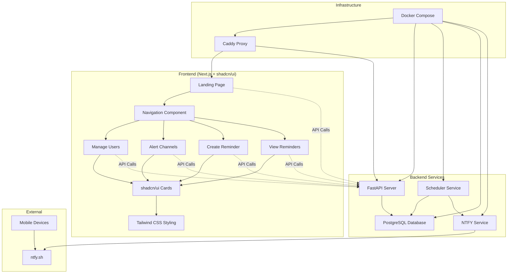

# Family Reminders

A modern family reminder scheduler with ntfy notifications, built with Next.js, FastAPI, and beautiful shadcn/ui components.

## System Architecture



## Features

### 🎨 Modern UI with shadcn/ui
- **Professional Design**: Built with shadcn/ui components for a polished, accessible interface
- **Responsive Layout**: Works seamlessly on desktop, tablet, and mobile devices
- **Navigation System**: Smart breadcrumb navigation with quick action buttons
- **Component Library**: Reusable UI components (Cards, Buttons, Forms) with consistent styling

### 🔔 Smart Notifications
- **ntfy Integration**: Push notifications to mobile devices via ntfy.sh
- **Alert Channels**: Create shared notification channels for family groups
- **Personal Topics**: Individual notification topics for each family member
- **Test Notifications**: Send test alerts to verify setup

### ⏰ Flexible Scheduling
- **Cron-based Scheduling**: Powerful cron expressions for complex schedules
- **Visual Schedule Builder**: User-friendly interface for creating schedules
- **Timezone Support**: Automatic timezone handling for each family member
- **Multiple Patterns**: Daily, weekly, monthly, yearly, and custom schedules

### 👥 Family Management
- **User Profiles**: Manage family members with individual settings
- **Timezone Configuration**: Set timezone preferences for each person
- **Topic Management**: Configure ntfy topics for each family member

## Technology Stack

### Frontend
- **Next.js 14**: React framework with App Router
- **shadcn/ui**: Modern component library built on Radix UI
- **Tailwind CSS**: Utility-first CSS framework
- **TypeScript**: Type-safe development
- **Lucide Icons**: Beautiful, consistent iconography

### Backend
- **FastAPI**: High-performance Python API framework
- **PostgreSQL**: Robust relational database
- **SQLAlchemy**: Python SQL toolkit and ORM
- **Pydantic**: Data validation using Python type annotations

### Infrastructure
- **Docker**: Containerized deployment
- **Caddy**: Modern web server with automatic HTTPS
- **ntfy**: Simple notification service

## Quick Start

### Development Mode (Hot Reloading)
```bash
./dev.sh
```
- ✅ Instant UI changes without rebuilding
- ✅ Hot reloading enabled
- ✅ Perfect for UI development with shadcn components

### Production Mode
```bash
./prod.sh
```
- ✅ Optimized build
- ✅ Production-ready deployment

### Stop All Services
```bash
./stop.sh
```

## Access Points
- **Web Interface**: http://192.168.1.185:8080
- **API Documentation**: http://192.168.1.185:8080/api/docs
- **Development**: Use `./dev.sh` for fast UI iteration
- **Production**: Use `./prod.sh` for final testing/deployment

## Project Structure

```
├── web/                          # Next.js Frontend
│   ├── app/                      # App Router pages
│   │   ├── page.tsx             # Landing page with feature cards
│   │   ├── layout.tsx           # Root layout with navigation
│   │   ├── users/               # User management
│   │   ├── alert-channels/      # Notification channels
│   │   ├── reminders/           # Reminder management
│   │   └── new/                 # Create reminder wizard
│   ├── components/              # Reusable components
│   │   ├── ui/                  # shadcn/ui components
│   │   │   ├── button.tsx       # Button component
│   │   │   └── card.tsx         # Card component
│   │   └── navigation.tsx       # Navigation with breadcrumbs
│   ├── lib/                     # Utilities
│   │   ├── api.ts              # API client functions
│   │   └── utils.ts            # shadcn/ui utilities
│   ├── components.json          # shadcn/ui configuration
│   ├── tailwind.config.ts       # Tailwind CSS config
│   └── package.json            # Dependencies
├── api/                         # FastAPI Backend
│   ├── app/
│   │   ├── main.py             # FastAPI application
│   │   ├── models.py           # Database models
│   │   ├── schemas.py          # Pydantic schemas
│   │   ├── db.py               # Database configuration
│   │   └── ntfy.py             # Notification service
│   ├── scheduler_main.py        # Background scheduler
│   └── requirements.txt         # Python dependencies
├── docker-compose.yml           # Production configuration
├── docker-compose.dev.yml       # Development configuration
├── Caddyfile                    # Reverse proxy config
├── .env                         # Environment variables
├── dev.sh                       # Development startup script
├── prod.sh                      # Production startup script
└── stop.sh                      # Stop all services
```

## shadcn/ui Integration

### Component System
The application uses shadcn/ui for a consistent, accessible design system:

- **Cards**: Used throughout for content organization
- **Buttons**: Primary and secondary actions with consistent styling
- **Forms**: Input fields, selects, and form validation
- **Navigation**: Breadcrumbs and navigation elements
- **Typography**: Consistent text styling and hierarchy

### Configuration
- **components.json**: shadcn/ui configuration file
- **Tailwind Integration**: Components use Tailwind CSS classes
- **Theme System**: CSS variables for consistent theming
- **Accessibility**: Built-in ARIA attributes and keyboard navigation

### Adding New Components
```bash
# Add new shadcn/ui components
npx shadcn@latest add [component-name]

# Example: Add a dialog component
npx shadcn@latest add dialog
```

## Development Workflow

### UI Development
1. Start development: `./dev.sh`
2. Navigate to `web/` directory
3. Make changes to components or pages
4. Changes appear instantly in browser
5. Use shadcn/ui components for consistency

### Adding Features
1. **Frontend**: Create new pages in `web/app/`
2. **Components**: Add reusable components in `web/components/`
3. **API**: Extend FastAPI endpoints in `api/app/main.py`
4. **Database**: Update models in `api/app/models.py`

### Navigation Updates
The navigation component automatically handles breadcrumbs for new pages. Add new routes to the `pathToBreadcrumbs` object in `web/components/navigation.tsx`.

## Environment Configuration

Key environment variables in `.env`:
- `DOMAIN`: Your server domain/IP
- `DATABASE_URL`: PostgreSQL connection string
- `NTFY_BASE_URL`: ntfy service URL
- `NEXT_PUBLIC_API_BASE`: Frontend API base path

## API Endpoints

### Users
- `GET /users` - List all users
- `POST /users` - Create new user
- `PUT /users/{id}` - Update user
- `DELETE /users/{id}` - Delete user

### Reminders
- `GET /reminders` - List reminders
- `POST /reminders` - Create reminder
- `PUT /reminders/{id}` - Update reminder
- `DELETE /reminders/{id}` - Delete reminder

### Alert Channels
- `GET /alert-channels` - List channels
- `POST /alert-channels` - Create channel
- `PUT /alert-channels/{id}` - Update channel
- `DELETE /alert-channels/{id}` - Delete channel

### Notifications
- `POST /notifications/test` - Send test notification

## Mobile Setup

1. Install ntfy app on your mobile device
2. Subscribe to your personal topic (e.g., `family-yourname`)
3. Test notifications from the web interface
4. Configure alert channels for family-wide notifications

## Troubleshooting

### Common Issues
- **Port conflicts**: Ensure port 8080 is available
- **Database connection**: Check PostgreSQL container status
- **Notifications not working**: Verify ntfy topic subscription on mobile
- **UI not updating**: Use development mode for hot reloading

### Logs
```bash
# View all service logs
docker-compose logs

# View specific service logs
docker-compose logs web
docker-compose logs api
docker-compose logs scheduler
```

## Contributing

1. Fork the repository
2. Create a feature branch
3. Make changes using shadcn/ui components
4. Test in development mode
5. Submit a pull request

## License

MIT License - see LICENSE file for details.